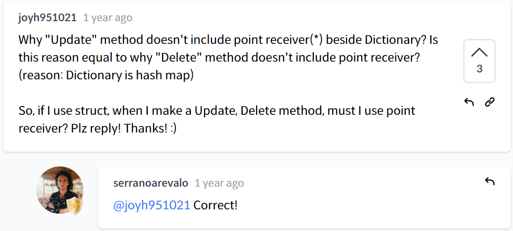

# THEORY

## introduction

- concurrency > make build extremely faster

## What are building

- Go를 보통 배우는 이유 : 프로젝트의 속도가 느려서 답답해서

-Go 의 데이터 도구는 multi-core, have concurrency

echo라는 라이브러리 사용할 것.

## Software and Installation
1. download Go
2. GO 코드는 GOPATH 에만 생성해야함.
3. javascript 는 npm, python은 pypi에서만 다운로드 받아서 코드를 사용할 수 있지만 Go는 아무데서나 받을 수 있고, 어디서 받은것인지 도메인으로 코드를 구분함.
4. 영상에서는 main.go를 열면 업데이트하라는게 무수히 뜬다고하지만 vscode가 최신버젼이라 그런지 그런 알림이 하나도 안 뜸. > 일단 진행!

## Main Package

main.go >> 이름에 대한 선택권이 없음. 컴파일할 경우에 사용. 컴파일러는 main.go 를 엔트리로 사용.
> 컴파일 안 할 경우에는 사람이름으로 패키지를 해도됨. 

go는 어떤 패키지를 작성하는지 작성해줘야함.
func 로 함수 선언.

# BANK & DICTIONARY PROJECTS

## Account + NewAccount

## Methods part One

## Methods part Two

## Finishing Up

## Dictionary part One

## Add Method

## Update Delete

hash map has the * included, struct doesn't
so if u use struct instead of map you should use pointers

# URL CHECKER & GO ROUTINES

## hit URL

## Slow URL CHecker

## Goroutines
time > Go 패키지
time.Sleep(time.Second)
보통 첫 함수를 순차적으로 프린트하고, 그 다음 함수를 프린트함

go 라고 적어줌으로써 병렬로 배치됨.

그런데, goroutine은 메인함수가 실행되는 동안에만 작동할 수 있음.

time.Sleep(time.Second * 5) 를 추가하면 5초동안 유지된다.

## Channels

## Channels Recap

## One more Recap
Remember : receiving a message is blocking operation!!

## URLChecker + Go Routines

## FAST URLChecker

# JOB SCRAPPER

## getPages part One

## getPages part Two

## extractJob part One

## extractJob part Two

## Writing Jobs

## Channels Time

## More Channels Baby

## Recap

# WEB SERVER WITH ECHO

## Setup Part One

## Setup Part Two

## File Download

## Conclusions